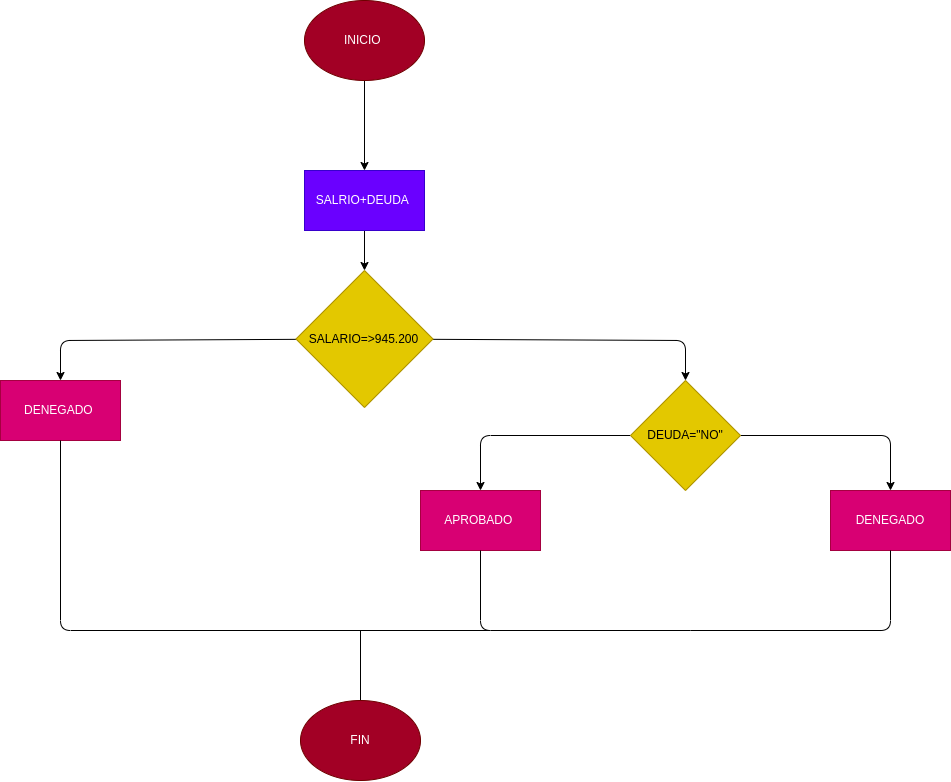

#  Prestamo Bancario
programa para saber si usted puede adquirir un prestamo en el banco segun su infreso mensual y si tiene deudas anteriores a su prestamo 

# ANALISIS 

variables de entrada (input)

Ingreso mensual = el dinero necesario para adquirir el prestamo 

Deuda = saber si tiene deudas anteriores o presentes 

Variables de proceso (processing)

Ingreso mensual>= numero ingresado 

Deuda = si o no tiene deudas 

Variables de salida (output)

APROBADO = elegible para el prestamo 

RECHAZADO = no cumple los requisistos para adquirir el prestamo 

nos indica si es elegible o no cumple con los requisitos para el prestamo 

# DISEÑO 
