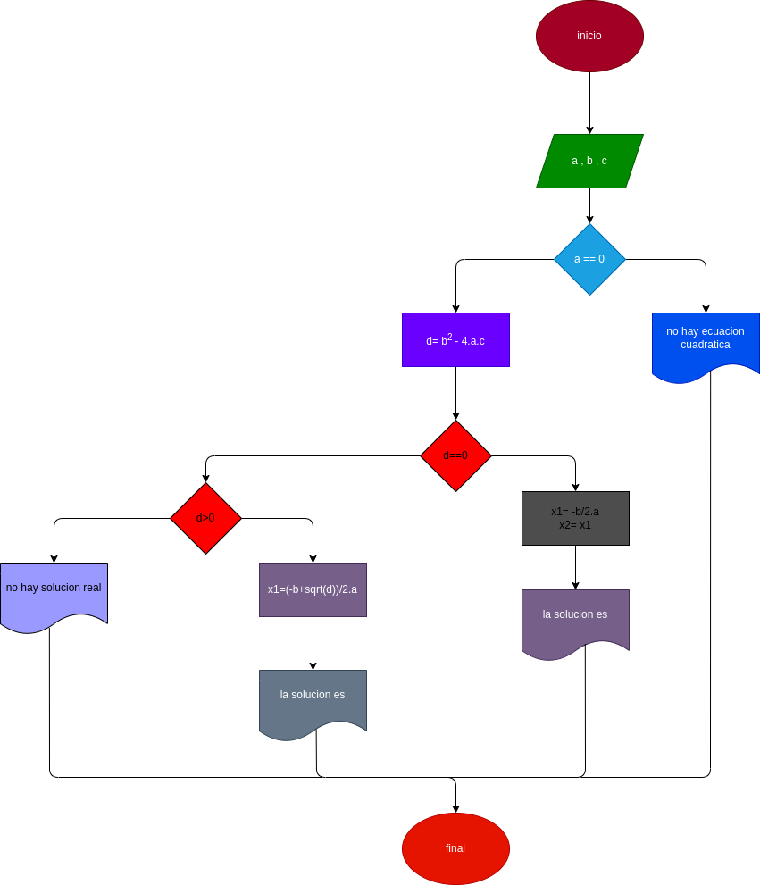

## ecuaciones cuadraticas
programa para calcular las raaices de la ecuación cuadratica de segundo grado de coeficientes reales

# ANALISIS
variables de entrada
- a = primer coeficiente
- b = segundo coeficiente
- c = tercer coeficiente

variables de proceso
- a es igual a 0?
- hacer operacion d = b**2-4*a*c
- d es igual a 0?
  - x1 = -b/(2*a)
  - x2 = x1
- d > 0
  - x1. = (-b+sqrt(d))/(2*a)
  - x2. = (-b-sqrt(d))/(2*a)
- d < 0

variables de salida
- si a es igual a 0 no es una ecuacion cuadratica
- si d es igual a 0 los resultados son x1 y x2
- si d es mayor a 0 los resultados son x1. y x2. 
- si d e menor que 0 no es una solucion real

# DISEÑO
